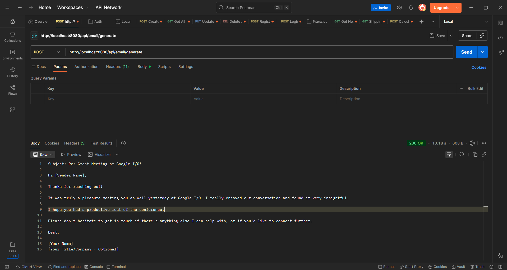

# ✉️ AI Email Generator API (Spring Boot | Gemini API)

🔗 Live API: Coming Soon (Currently runs on localhost)  
📂 GitHub Repo: https://github.com/aishwaryabehare1504/email-writer-sb1  

---

## 📋 Project Overview

An AI-powered Email Generator application that provides REST APIs to generate professional email replies based on user input.

💡 Demonstrates backend development, REST API design, external API integration, and prompt engineering using Gemini API.

### It allows:
- Generate email replies automatically  
- Customize tone (formal, friendly, casual, etc.)  
- Convert raw input into professional email format  

---

## 🏗️ Architecture

### 🔹 Core Components

**1. Controller Layer**
- `EmailGeneratorController.java`  

**2. Service Layer**
- `EmailGeneratorService.java`  

**3. Model / DTO**
- `EmailRequest.java`  

---

## 🚀 Features

- AI-based email generation  
- Tone customization  
- RESTful API design  
- Gemini API integration  
- Prompt-based email generation using LLM  
- Clean backend structure  

---

## 📸 API Screenshots

### 🔹 Generate Email Response


---

## 📁 Project Structure

```
com.email.writer
│
├── EmailGeneratorController.java
├── EmailGeneratorService.java
└── EmailRequest.java
```

---

## ⚙️ Tech Stack

- Spring Boot  
- Java  
- Gemini API (Google AI)  
- Spring WebFlux (WebClient)  
- Maven  

---

## 🔧 Configuration

```
gemini.api.url=your_api_url
gemini.api.key=your_api_key
```

Or using environment variables:

```
GEMINI_API_URL=your_api_url
GEMINI_API_KEY=your_api_key
```

---

## 🚀 API Endpoint

### 📧 Email API
- POST `/api/email/generate`

---

## 💡 Sample Request

```json
{
  "emailContent": "Hello, thank you for reaching out to us. It was great meeting you at Google IO yesterday",
  "tone": "friendly"
}
```

---

## 💡 Sample Response

```
Subject: Re: Great Meeting at Google IO!

Hi [Sender's Name],

Thanks so much for reaching out!

It was truly a pleasure meeting you as well at Google IO yesterday. I really enjoyed our conversation and the insights you shared. The energy at the event was fantastic!

Please don't hesitate to reach out if there's anything I can help with or if you'd like to continue our discussion.

Looking forward to staying in touch!

Best regards,

[Your Name]
[Your Title]
[Your Company]
```

---

## 🔒 Security

- API key stored securely using environment variables  
- No hardcoded credentials  

---

## 🚨 Challenges

- Integrating Gemini API  
- Handling JSON response parsing  
- Designing effective prompts  

---

## 📈 Future Enhancements

- Multiple email templates  
- Multi-language support  
- Frontend UI  
- Deployment  
- Authentication system  

---

## 🤝 Contributing

📌 This project is built for learning and demonstration purposes.

Currently, contributions are not open. However, suggestions and feedback are welcome.

---

## 📄 License

This project is for learning and demonstration purposes only.

---

## 🔗 Connect

- 🔗 GitHub: https://github.com/aishwaryabehare1504/email-writer-sb1
- 💼 LinkedIn: https://www.linkedin.com/in/aishwarya-behare-45191b307/

---

## ❤️ Built With

Java + Spring Boot + Gemini API
